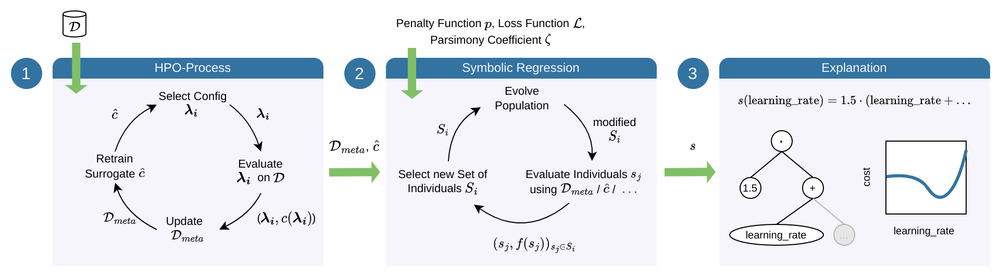

# Symbolic Explanations for Hyperparameter Optimization

Symbolic explanations can provide explicit formulas quantifying the relation between hyperparameter values and model 
performance by applying symbolic regression to meta-data collected with Bayesian optimization:


## Installation

You can create an environment with all required packages using anaconda and the `environment.yml` 
file as demonstrated in the following:

```
conda env create -f environment.yml
conda activate symb_expl
```

To install HPOBench, please run the following after activating the environment:
```
pip install git+https://github.com/automl/HPOBench.git
```

## tl;dr: Summary of Commands to Reproduce the Results

To run the experiments for reproducing the results shown in the paper, we suggest the following
order of commands. To create the raw results, first run:
```
python run_sampling_hpobench.py --job_id 0 --run_type smac
python run_sampling_hpobench.py --job_id 0 --run_type rand
python run_sampling_hpobench.py --job_id 0 --run_type surr
python run_symbolic_explanation_hpobench.py --job_id 0 --run_type smac
python run_symbolic_explanation_hpobench.py --job_id 0 --run_type rand
python run_symbolic_explanation_hpobench.py --job_id 0 --run_type surr
python run_surrogate_explanation_hpobench.py --job_id 0
```

After running the above commands, to calculate metrics and create plots, run:
```
python metrics_hpobench.py --job_id 0
python plot_learning_curves_hpobench.py --job_id 0
python plot_complexity_vs_rmse.py --job_id 0
python plot_2d_hpobench.py --job_id 0
```

`--job_id 0` will run the experiments for logistic regression with hyperparameters `alpha` and `eta0` on the 
dataset `blood-transfusion-service-center`. To reproduce the results for all models, hyperparameter combinations, 
and datasets shown in the paper, the above commands need to be run with `job_id` between 0-39.

## Details on Running the Experiments

In the following, we describe how to run the experiments in more detail. The overall process consists of the 
following steps: 
1. Run the Bayesian optimization-powered hyperparameter optimization tool SMAC and collect (a) the meta-data 
consisting of the evaluated configurations and their performance and (b) the final surrogate model.
2. Learn a symbolic regression model on either (a) the collected meta-data, or (b) randomly sampled
configurations, which are evaluated using the true cost function, or (c) randomly sampled
configurations, whose performance is estimated using the Gaussian process.

### Run Settings

Which models and datasets should be included in the experiments can be defined in `utils/hpobench_utils`. As done in 
the paper, by default 8 datasets and 5 models are included. 
For each model and dataset, one hyperparameter-combination is evaluated. 
This can be adapted by modifying the parameter `max_hp_comb` inside the run scripts. 
The argument `job_id`, which can be passed to the run scripts, is an index to iterate over all models, 
hyperparameter-combinations, and datasets.

By default, the experiments are run for one parsimony coefficient (0.0001). 
To run the symbolic regression with multiple values for the parsimony coefficient, more values can be added via the 
parameter `parsimony_coefficient_space` defined in the `run_symbolic_explanation_hpobench.py` script.

### Collection of Training Samples for the Symbolic Regression

Collecting the samples as described in step 1 can be run for a single model, hyperparameter-combination, and dataset, 
by running:

```
python run_sampling_hpobench.py --job_id 0 --run_type smac
```

By setting `run_type` to `rand`, the script furthermore allows to collect randomly sampled configurations and evaluate 
their performance. When setting `run_type` to `surr`, the script will collect random samples, but estimated their 
performance using the Gaussian process. Please note that, in the latter case, the BO sampling needs to be run 
beforehand to provide the Gaussian process models.

### Symbolic Regression

Fitting the symbolic regression model as described in step 2 can be run for a single model, hyperparameter-combination, 
and dataset, by running:

```
python run_symbolic_explanation_hpobench.py --job_id 0 --run_type smac
```

This way, the symbolic regression will be fitted on the samples collected during Bayesian optimization (a).
By setting `run_type` to `rand`, the symbolic regression will be fitted on the randomly 
sampled configurations (b). When setting `run_type` to `surr`, the symbolic regression
will be fitted on the random samples with Gaussian process performance estimates (c). 

### Gaussian Process Baseline

Furthermore, the predictions of the Gaussian process model can be obtained for a single model, 
hyperparameter-combination, and dataset, by running:

```
python run_surrogate_explanation_hpobench.py --job_id 0
```

### Metrics

To average metrics over different seeds for a single model, hyperparameter-combination, and dataset, run:
```
python metrics_hpobench.py --job_id 0
```
Omitting `--job_id 0` will run the script for all all models, hyperparameter combinations, and datasets, and combine 
the resulting metrics in a table. In this case, the experiments described above need to be run for all of them beforehand.

### Plots

With the commands shown below, plots can be created for a single model, hyperparameter-combination, and dataset. 
Omitting `--job_id 0` will create one plot for each model, hyperparameter combination, and dataset. In this case, the 
experiments described above need to be run for all of them beforehand.

To create a plot showing several representations of the HPO loss landscape, run:
```
python plot_2d_hpobench.py --job_id 0
```

To create a plot showing the RMSE between the cost predicted by the symbolic regression and the true cost for
different numbers of samples, run:
```
python plot_learning_curves_hpobench.py --job_id 0
```

To create a plot showing the RMSE between the cost predicted by the symbolic regression and the true cost for different
values of the parsimony coefficient, run:
```
python plot_complexity_vs_rmse.py --job_id 0
```
For the latter, the experiments described above should be run with multiple values of the parsimony coefficient 
beforehand.

## Cite Us

If you use Symbolic Explanations in your research, please cite our paper:

```bibtex
@inproceedings{segel-automl23,
    title        = {Symbolic Explanations for Hyperparameter Optimization},
    author       = {Sarah Segel and Helena Graf and Alexander Tornede and Bernd Bischl and Marius Lindauer},
    booktitle = {Proceedings of the International Conference on Automated Machine Learning ({AutoML'23)},
    year = 	 {2023}
}
```

The experiments for this paper were conducted with the code in version `0.1.0`.